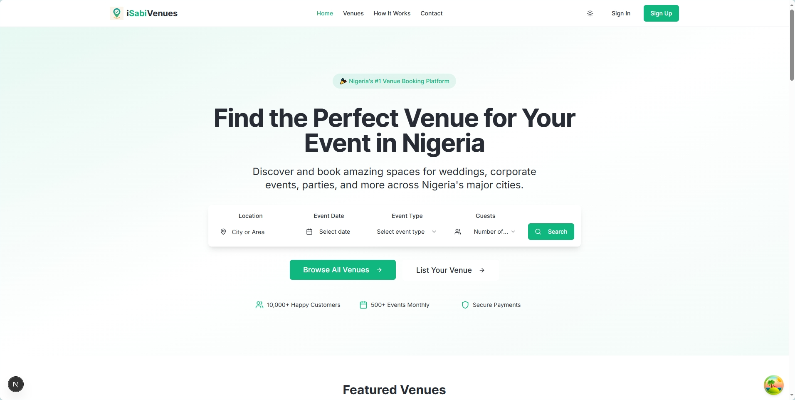
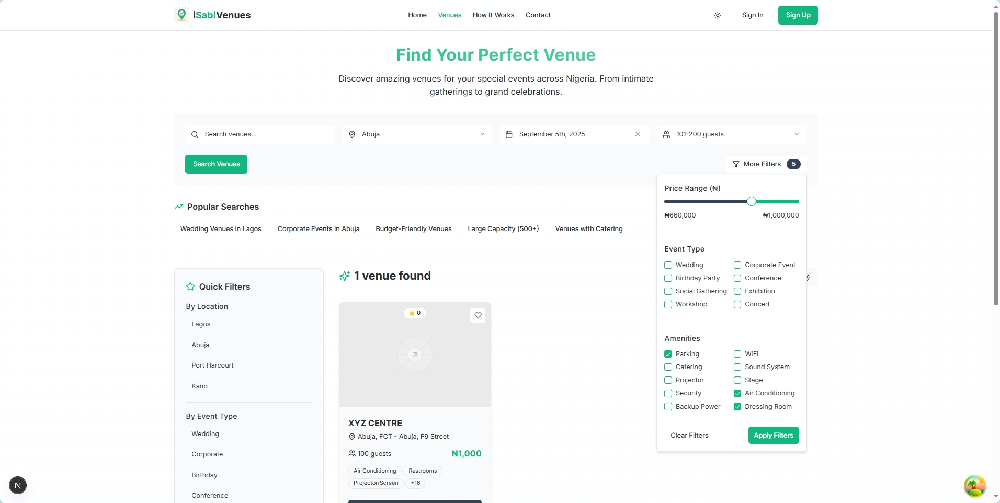

# iSabiVenues – Event Venue Discovery & Booking Platform  

## Problem  
Finding event venues in Nigeria is frustrating. Most planners still rely on word-of-mouth, endless calls, or social media posts. Pricing is opaque, booking is stressful, and cancellations or double-bookings are common.  

## Solution  
I built **iSabiVenues**, a digital marketplace where event organizers and venue owners can connect seamlessly.  
- Organizers discover venues based on location, price, and capacity.  
- Venue owners list and manage their spaces.  
- Booking and communication happen directly on the platform.  

## Features  
- Venue search & filtering (location, capacity, pricing).  
- Secure booking requests.  
- Messaging between organizers & venue owners.  
- Venue management dashboard.  

  
*Venue discovery with filters by location, price, and capacity.*

  
*Venue discovery with filters by location, price, and capacity.*

## Tech Stack  
- **Backend** → NestJS (REST + GraphQL APIs), PostgreSQL, Docker  
- **Frontend** → Next.js 15, React Query, Tailwind  
- **Other** → JWT Auth, Role-based Access, Cloud Deployment  

## My Role  
- Designed & built backend and frontend from scratch.  
- Architected hybrid API (REST + GraphQL) for flexibility.  
- Integrated authentication, venue, booking, payment, and notifications modules.  

## Impact  
- Early traction with venue owners listing properties in Lagos.  
- Positioned as a first-mover platform to digitize Nigeria’s event venue market.  

## What’s Next  
- Payment integration for instant bookings.  
- AI-powered venue recommendations.  
- Expansion to Abuja & Port Harcourt.  

## Links  
- Live: [isabivenues.com.ng](https://isabivenues.com.ng)

## Timeline  
- 2024 – MVP launched.  
- 2025 – Active as a growing small business.  
